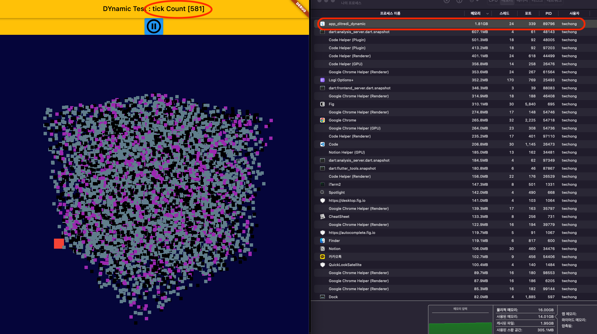
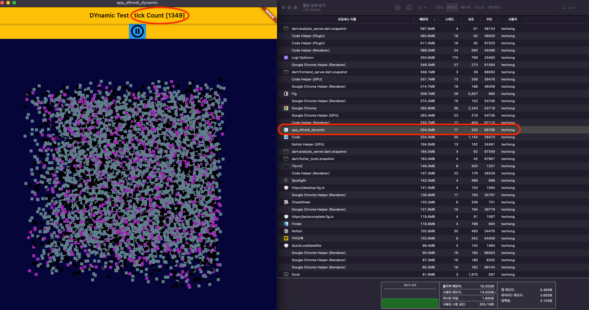

# app_ditredi_dynamic

A new Flutter project for DiTreDi library using Dynamic

## Lib

[DiTreDi](https://pub.dev/packages/ditredi)

## result

- The app used DiTreDi library was increased memory usage when 3D dataset updated.
- The CanvasModelPainter class in canvas_model_painter.dart causes memory increased when updating 3D dataset.

|                | before | after  |
|----------------|--------|--------|
| Num. of Update | 581    | 1.81GB |
| Memory usage   | 1349   | 204MB  |

 
