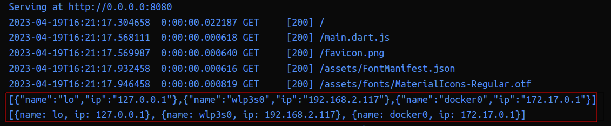
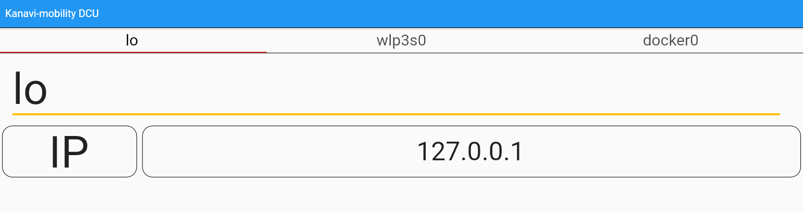

# http server and web gui on Embedded System

- http server using dart
- web page using flutter
- get Network Information for Embedded System

## build

```bash
cd /web_gui/
flutter build web
```

- using Vscode and Debugging

## result

### Loading Status


### get Network Information in http Server on Embedded System



### Network Information Display Using Web GUI


